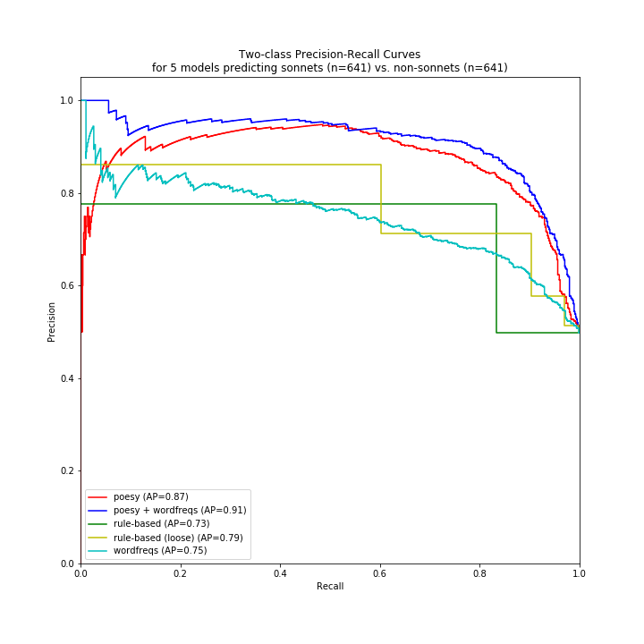

# The Sonnet Project

What's a sonnet to a machine by any other name?

Using [poesy](https://github.com/quadrismegistus/poesy) to collect poetic features about sonnets (rhyme, meter, line length), this micro-experiment asks: which textual features best predict whether 14 lines of verse is a sonnet? Word frequencies, or poetic features? Answer: the latter.

## Pipeline of experiment

This experiment was done to maximize replicability. Please join in, either at Step 2 (make your own featuresets) or at Step 3 (change how classification works). Which featuresets and classifiers can best predict sonnets?

* **[Step1-MakeSonnetCorpus.ipynb](Step1-MakeSonnetCorpus.ipynb)**: From whole of Chadwyck-Healey's poetry collections, save a small sample of sonnets (n=650) and non-sonnets (n=650) to `corpus/`. These were balanced by historical period (quarter-century when author was 30 years old).
	* *How to replicate*: This step cannot be replicated without access to the full corpus.

* **[Step2-GenerateFeatureSets.ipynb](Step2-GenerateFeatureSets.ipynb)**: From the 1300 sonnet text files in `corpus/`, generate featuresets to save in `featuresets/`, where the index is the filename in `corpus/` (e.g. `corpus/Sonnets/Z200383337.txt`).
	* *How to replicate:* rerun this notebook. You'll need [poesy](https://github.com/quadrismegistus/poesy) (Poetic proceessing for Python) and [mpi-slingshot](https://github.com/quadrismegistus/mpi-slingshot) to re-run the poetic features. Or just create your own  featureset (with the same indices) and save it to `featuresets/` .

* **[Step3-CompareModels.ipynb](Step3-CompareModels.ipynb)**: Classify sonnets-vs-nonsonnets using the featuresets in `featuresets/`, as well as combinations of these featuresets. Results are shown and interpreted at the bottom.
	* *How to replicate*: rerun this notebook. No special python libraries are needed.

## Major results

### Precision/recall table

The models that best predict sonnets are:

| model              | precision | recall | fscore |
|--------------------|-----------|--------|--------|
| Poesy + Wordfreqs  | 0.884     | 0.822  | 0.852  |
| Poesy              | 0.853     | 0.801  | 0.826  |
| Rule-Based         | 0.776     | 0.834  | 0.804  |
| Rule-Based (Loose) | 0.577     | 0.969  | 0.723  |
| Wordfreqs          | 0.707     | 0.700  | 0.703  |

Interpretation:

* Poetic features (from [poesy](https://github.com/quadrismegistus/poesy)) in a logistic model perform best (F1=0.83); adding word frequencies to them improves the model slightly (F1=0.85).
* Poetic features in rule-based classifiers perform second best (F1=0.81).
* The word frequency model performs worst (F1=0.70).

### Precision/recall curves

The tradeoffs between precision and recall in these models can be seen here:

### Important features

#### Which are the top 10 best predictors of sonnets?

* Having long lines (*meter length avg parse* and *meter length avg line*).
* Rhyming 5->8 (as in abbaCddC); 6->7 (abbacDDc); 1-4 (AbbA); 2->3 (aBBa); 2->6 (aBbaaBba [Petrarchan])
* Having a sonnet rhyme scheme (poesy finds best fit for rhyme scheme among its [list of rhyme schemes](https://github.com/quadrismegistus/poesy/blob/master/poesy/schemes/rhyme_schemes.txt)).

| feat                                  | model | coeff |
|---------------------------------------|-------|-------|
| meter length avg parse                | poesy | 0.091 |
| meter length avg line                 | poesy | 0.091 |
| rhymes l05-l08                        | poesy | 0.077 |
| rhyme scheme acc Sonnet H             | poesy | 0.062 |
| rhymes l06-l07                        | poesy | 0.056 |
| rhymes l01-l04                        | poesy | 0.055 |
| rhymes l02-l03                        | poesy | 0.053 |
| rhyme scheme acc Sonnet, Petrarchan C | poesy | 0.050 |
| rhymes l02-l06                        | poesy | 0.049 |
| rhyme scheme acc Sonnet, Petrarchan A | poesy | 0.049 |

#### Which are the top 25 best predictors of non-sonnets?

* Having couplets in the poem (many features are successive lines rhyming with each other).
* Having the fourth syllable be weak (*meter perc lines fourthpos w*), indicating a trochaic-like line, swsW or an anapestic one, wwsW.
* Having ternary feet (*meter mpos ww*).

| feat                         | model | coeff  |
|------------------------------|-------|--------|
| rhymes l11-l12               | poesy | -0.084 |
| rhyme scheme acc Couplet     | poesy | -0.081 |
| rhymes l01-l02               | poesy | -0.076 |
| rhymes l05-l06               | poesy | -0.070 |
| rhymes l09-l10               | poesy | -0.061 |
| rhymes l07-l08               | poesy | -0.060 |
| rhymes l03-l04               | poesy | -0.057 |
| rhymes l13-l14               | poesy | -0.056 |
| meter perc lines fourthpos w | poesy | -0.046 |
| meter mpos ww                | poesy | -0.043 |