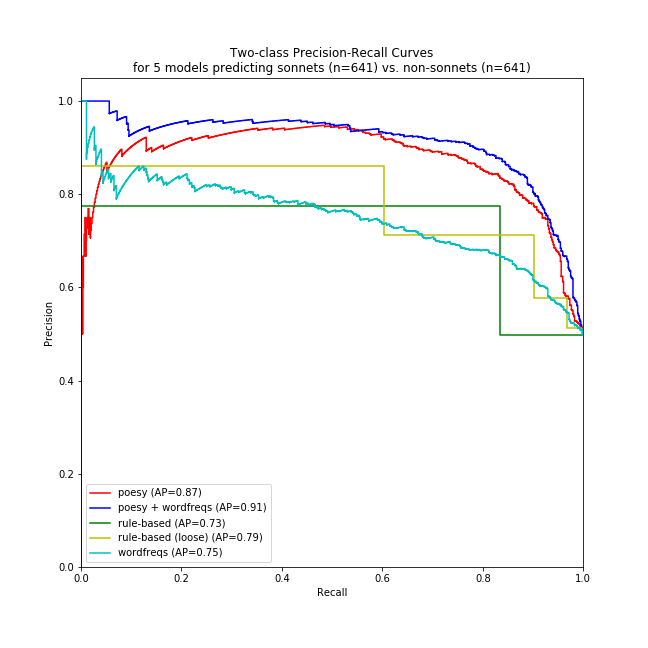

# The Sonnet Project

What's a sonnet to a machine by any other name anyway?

## Pipeline of experiment

This experiment was done to maximize replicability. Please join in, either at Step 2 (make your own featuresets) or at Step 3 (change how classification works). Which featuresets and classifiers can best predict sonnets?

* **[Step1-MakeSonnetCorpus.ipynb](Step1-MakeSonnetCorpus.ipynb)**: From whole of Chadwyck-Healey's poetry collections, save a small sample of sonnets (n=650) and non-sonnets (n=650) to `corpus/`. These were balanced by historical period (quarter-century when author was 30 years old).
	* *How to replicate*: This step cannot be replicated without access to the full corpus.

* **[Step2-GenerateFeatureSets.ipynb](Step2-GenerateFeatureSets.ipynb)**: From the 1300 sonnet text files in `corpus/`, generate featuresets to save in `featuresets/`, where the index is the filename in `corpus/` (e.g. `corpus/Sonnets/Z200383337.txt`).
	* *How to replicate:* rerun this notebook. You'll need [poesy](https://github.com/quadrismegistus/poesy) (Poetic proceessing for Python) and [mpi-slingshot](https://github.com/quadrismegistus/mpi-slingshot) to re-run the poetic features. Or just add to the bottom of notebook, or create your own, to save a featureset in `featuresets/` with the same indices.

* **[Step3-CompareModels.ipynb](Step3-CompareModels.ipynb)**: Classify sonnets-vs-nonsonnets using the featuresets in `featuresets/`, as well as custom variations. Results are shown and interpreted at the bottom.
	* *How to replicate*: rerun this notebook. No special python libraries are needed.

## Major results

### Precision/recall table

The models that best predict sonnets are:

| model              | precision | recall | fscore |
|--------------------|-----------|--------|--------|
| Poesy + Wordfreqs  | 0.884     | 0.822  | 0.852  |
| Poesy              | 0.853     | 0.801  | 0.826  |
| Rule-Based         | 0.776     | 0.834  | 0.804  |
| Rule-Based (Loose) | 0.577     | 0.969  | 0.723  |
| Wordfreqs          | 0.707     | 0.700  | 0.703  |

Poetic features (poesy) in a logistic model perform best; poetic features in rule-based classifiers perform second best; the word frequency model performs worst.

### Precision/recall curves

